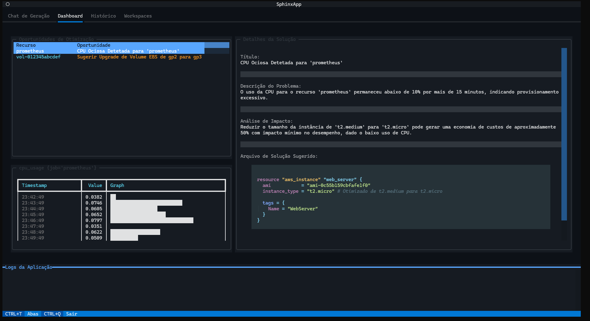
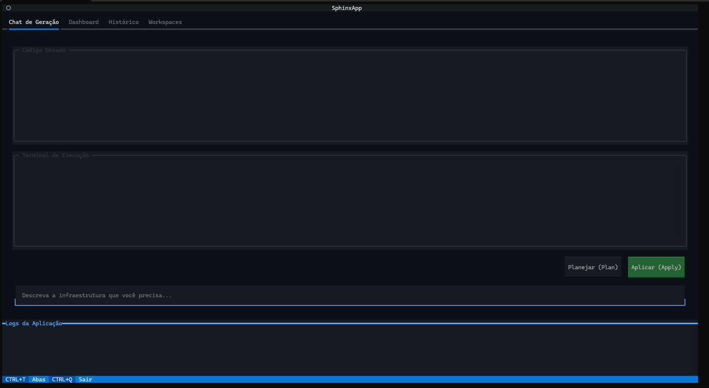
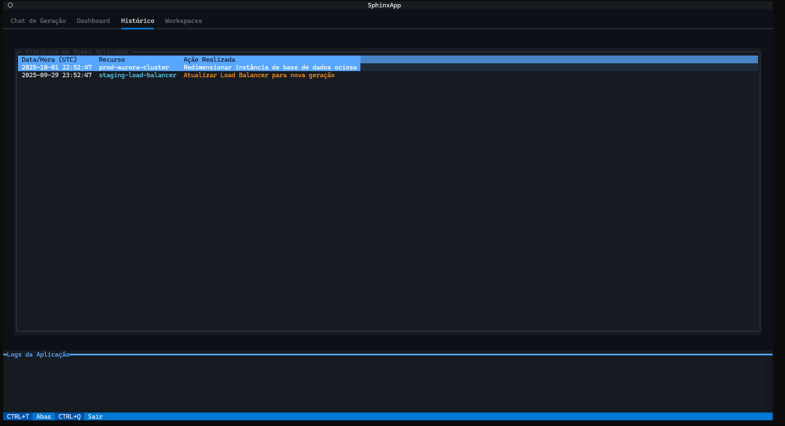

# Sphinx - Autonomous Cloud Engineering Platform

Sphinx is an interactive and cutting-edge autonomous cloud engineering platform, meticulously developed in Python to operate entirely within the terminal environment. This project was conceived to empower DevOps engineers, cloud architects, SREs, and infrastructure professionals with advanced tools for observability, intelligent optimization, and Infrastructure as Code (IaC) generation. The Sphinx architecture implements state-of-the-art techniques in AI-driven cloud management, including generative models like Gemini for IaC creation, anomaly detection systems, and closed-loop automation. The structure rigorously follows Clean Architecture principles with the Hexagonal pattern, ensuring modularity, scalability, enterprise maintainability, and clear separation of responsibilities. The system stands out for its ability to integrate real-time metrics from Prometheus, the sophistication of its Terminal User Interface built with the Textual framework, the robustness of its plugin system for extensibility, and the inclusion of a comprehensive action history mechanism with SQLite persistence.

## 🚀 Executable Available

📦 **Direct Download**: Pre-compiled executable available in the [Releases](https://github.com/thiagodifaria/Sphinx/releases/download/v1.0.0/sphinx) section - No Python installation required!

## 🎯 Features

- ✅ **AI-powered IaC generation**: Natural language to Terraform code via Gemini
- ✅ **Real-time observability**: Prometheus metrics integration with live dashboard
- ✅ **Intelligent optimization**: Automatic detection of cost and performance opportunities
- ✅ **Anomaly detection**: Rule-based and plugin-driven analysis engine
- ✅ **Complete IaC workflow**: Generate, plan, and apply Terraform changes from TUI
- ✅ **Action history**: SQLite-based audit trail of all infrastructure modifications
- ✅ **Multi-workspace management**: Organize infrastructure configurations by environment
- ✅ **Plugin architecture**: Extensible analysis with custom Python plugins
- ✅ **Advanced metrics visualization**: Real-time charts and metric displays
- ✅ **Closed-loop automation**: From anomaly detection to suggested code changes
- ✅ **YAML-based rules**: Declarative configuration for detection conditions
- ✅ **Terraform orchestration**: Seamless plan/apply execution with async UI
- ✅ **AWS resource optimization**: Built-in plugins for EBS GP2→GP3 migration
- ✅ **Rich terminal interface**: Multi-tab TUI with chat, dashboard, history, and workspaces

## 🔧 Technologies

### Core Technologies
- **Python 3.11+**: Main programming language with modern async/await patterns
- **Textual 0.56+**: Advanced asynchronous TUI framework for rich terminal interfaces
- **Typer**: Elegant CLI construction with Rich integration
- **Pydantic 2.7+**: Data validation, serialization, and settings management
- **Dependency Injector**: Inversion of Control container for Clean Architecture

### AI & Optimization
- **Google Generative AI**: Gemini models for IaC generation and optimization suggestions
- **Custom Anomaly Detection**: Rule-based and statistical anomaly identification
- **Plugin System**: Dynamic loading of custom analysis rules
- **YAML Rules Engine**: Declarative threshold-based detection logic

### Observability & Infrastructure
- **Prometheus API Client**: Real-time metrics querying and aggregation
- **Terraform**: Infrastructure as Code execution and state management
- **Docker Compose**: Containerized Prometheus for local development
- **AsyncIO**: Non-blocking operations throughout the application stack

### Data & Persistence
- **aiosqlite**: Asynchronous SQLite for history and workspace management
- **PyYAML**: YAML parsing for rules and configuration files
- **python-dotenv**: Environment variable management with .env support

## 📈 Architecture

### Clean Architecture Layers

#### Core Layer (`app/core/`)
Pure business logic with no external dependencies:
- **Domain Models**: `OptimizationOpportunity`, `IaCFile`, `Metric`, `Workspace`
- **Use Cases**: `RunAnalysisCycleUseCase`, `GenerateIacUseCase`, `ApplyInfrastructureChangesUseCase`
- **Ports**: Abstract interfaces for gateways and providers
- **Services**: `AnomalyDetectionService` for statistical analysis
- **Plugin Interfaces**: `AnalysisRulePlugin` base class for extensibility

#### Adapters Layer (`app/adapters/`)
Implementation of core ports for external systems:
- **Gateways**: `GeminiAdapter`, `PrometheusGateway`, `SQLiteHistoryRepository`, `YamlRuleRepository`
- **Providers**: `TerraformProvider`, `AwsCloudProvider` for IaC and cloud operations

#### Infrastructure Layer (`app/infrastructure/`)
Framework-specific and volatile implementation details:
- **TUI**: Textual-based interface with `SphinxApp`, screens, and widgets
- **CLI**: Typer command-line entry point
- **DI Container**: Dependency injection configuration with `dependency-injector`
- **Configuration**: Pydantic Settings with environment variable support

### Data Flow

```
User Input (TUI/CLI)
    ↓
Controllers (TUI Event Handlers)
    ↓
Use Cases (Business Logic)
    ↓
Ports (Abstract Interfaces)
    ↓
Adapters (Gateway/Provider Implementations)
    ↓
External Systems (Prometheus, Gemini, Terraform, SQLite)
```

## 🎯 Advanced Features

### Generative AI for IaC
- **Natural Language Input**: Describe infrastructure needs in plain English/Portuguese
- **Gemini Integration**: LLM generates valid Terraform HCL code with proper resource syntax
- **Structured Output**: JSON-parsed responses ensure consistent code generation
- **Expert Prompting**: System prompts instruct model as senior Terraform specialist
- **TUI Integration**: Generated code displayed in chat interface with immediate plan/apply

### Optimization Dashboard
- **Continuous Analysis Cycle**: Background task constantly evaluates infrastructure health
- **Multi-Source Detection**: YAML rules + custom plugins identify opportunities
- **Evidence-Based Recommendations**: Each opportunity backed by Prometheus metrics
- **AI-Enhanced Solutions**: Gemini generates impact assessments and corrected IaC code
- **Interactive Review**: Browse opportunities, view metrics, and apply changes from dashboard

### Plugin System
- **Dynamic Discovery**: `PluginManager` auto-loads Python files from `plugins/` directory
- **Interface-Based**: All plugins implement `AnalysisRulePlugin.analyze()` method
- **Metric Access**: Plugins receive filtered metrics for domain-specific analysis
- **Opportunity Generation**: Return `OptimizationOpportunity` objects with evidence
- **Examples Included**: `EbsGp2ToGp3RulePlugin` and `example_memory_rule.py` templates

### YAML Rules Engine
- **Declarative Configuration**: Define detection logic without code in `rules.yml`
- **Flexible Operators**: `less_than`, `greater_than`, `equals` threshold comparisons
- **Duration Windows**: `duration_minutes` for sustained condition detection
- **Template Rendering**: Dynamic title/description with variable interpolation
- **Prometheus Integration**: Direct PromQL metric name specification

### Workspace Management
- **Multi-Environment Support**: Separate configurations for dev, staging, production
- **Active Workspace State**: Global singleton tracks current working context
- **Persistent Storage**: SQLite maintains workspace metadata and configurations
- **TUI Navigation**: Dedicated screen for creating, switching, and managing workspaces

### Action History
- **Complete Audit Trail**: Every infrastructure change logged with timestamp
- **SQLite Persistence**: Asynchronous database operations for non-blocking writes
- **Rich Metadata**: Captures workspace, action type, status, and full details
- **History Viewer**: TUI screen displays chronological list of all actions
- **Searchable Records**: Filter and review past modifications for compliance

## 📋 Prerequisites

- Python 3.11 or higher
- Poetry (package manager)
- Docker & Docker Compose (optional, for local Prometheus)
- Terraform CLI (for IaC operations)

## 🚀 Installation

```bash
# Clone the repository
git clone https://github.com/thiagodifaria/Sphinx.git
cd Sphinx

# Install dependencies with Poetry
poetry install

# Activate virtual environment
poetry shell
```

## ⚙️ Configuration

1. Create a `.env` file in the project root:
   ```bash
   touch .env
   ```

2. Add required environment variables to the `.env` file:
   ```env
   # Required: Google Gemini API Key
   GOOGLE_API_KEY=your_google_api_key_here
   
   # Required: Prometheus endpoint
   PROMETHEUS_URL=http://localhost:9090
   
   # Optional: Database path (default: sphinx.db)
   SQLITE_DB_PATH=sphinx.db
   
   # Optional: Terraform S3 backend configuration
   TF_BACKEND_S3_BUCKET=your-terraform-state-bucket
   TF_BACKEND_S3_KEY=terraform.tfstate
   TF_BACKEND_S3_REGION=us-east-1
   
   # Optional: Rules and plugins paths
   RULES_FILE_PATH=rules.yml
   PLUGINS_DIR=plugins
   ```

3. Configure Prometheus (optional for local development):
   ```bash
   # Start Prometheus with Docker Compose
   docker-compose up -d prometheus
   
   # Prometheus will be available at http://localhost:9090
   ```

4. Customize analysis rules in `rules.yml`:
   ```yaml
   rules:
     - name: "High Memory Usage"
       metric_name: "container_memory_usage_bytes"
       condition:
         operator: "greater_than"
         threshold: 85
         duration_minutes: 5
       opportunity_title_template: "High Memory on '{resource_id}'"
       opportunity_description_template: "Memory usage exceeded {threshold}%"
   ```

## 🖥️ Running the Application

```bash
# Launch Sphinx TUI
poetry run sphinx

# Or if poetry shell is activated
sphinx

# Run with custom config file
RULES_FILE_PATH=custom-rules.yml sphinx
```

## 📊 How to Use

### Main Interface Tabs

#### 1. Chat Generation
- Enter natural language descriptions of infrastructure needs
- Example: "Create an AWS S3 bucket with versioning enabled"
- View generated Terraform code in real-time
- Copy code or proceed directly to plan/apply

#### 2. Dashboard
- Browse list of detected optimization opportunities
- View detailed metrics and evidence for each opportunity
- See AI-generated impact assessments and solution code
- Apply suggested changes with one click
- Monitor Terraform execution output

#### 3. History
- Review chronological list of all infrastructure actions
- Filter by workspace, action type, or status
- View complete details of past changes
- Export history for compliance reporting

#### 4. Workspaces
- Create new workspaces for different environments
- Switch active workspace context
- Manage workspace-specific configurations
- Delete unused workspaces

### Log Viewer (Footer)
- Real-time logs from all background operations
- Color-coded severity levels (INFO, WARNING, ERROR)
- Automatic scrolling with scroll lock toggle
- Persistent throughout all tabs

## 🧪 Tests

```bash
# Run all tests
poetry run pytest

# Run with coverage report
poetry run pytest --cov=app tests/

# Run specific test file
poetry run pytest tests/test_use_cases.py

# Run mypy type checking
poetry run mypy app/
```

## 🔌 Creating Custom Plugins

1. Create a new Python file in the `plugins/` directory:
   ```python
   # plugins/my_custom_rule.py
   from app.core.plugins.interfaces import AnalysisRulePlugin
   from app.core.domain.models.observability import Metric
   from app.core.domain.models.optimization import OptimizationOpportunity
   
   class MyCustomRulePlugin(AnalysisRulePlugin):
       def analyze(self, metrics: list[Metric]) -> list[OptimizationOpportunity]:
           opportunities = []
           
           # Your custom analysis logic here
           for metric in metrics:
               if self._should_optimize(metric):
                   opp = OptimizationOpportunity(
                       title=f"Custom optimization for {metric.labels.get('instance')}",
                       description="Your description",
                       resource_address="aws_instance.example",
                       evidence=[metric]
                   )
                   opportunities.append(opp)
           
           return opportunities
       
       def _should_optimize(self, metric: Metric) -> bool:
           # Your detection logic
           return metric.value > 80
   ```

2. Restart Sphinx - the plugin will be automatically discovered and loaded

## 📷 Screenshots

### Dashboard - Optimization Opportunities


### Chat - AI-Powered IaC Generation


### Metrics Visualization


### Action History


## 🚢 Deploy

### Standalone Executable
```bash
# Install PyInstaller
poetry add --group dev pyinstaller

# Create executable
poetry run pyinstaller --onefile --name sphinx app/__main__.py
```

### Docker Container
```bash
# Build image
docker build -t sphinx:latest .

# Run container
docker run -it --rm \
  -e GOOGLE_API_KEY=your_key \
  -e PROMETHEUS_URL=http://host.docker.internal:9090 \
  sphinx:latest
```

## 📜 License

This project is licensed under the MIT License - see the [LICENSE](LICENSE) file for details.

## 📞 Contact

Thiago Di Faria - [thiagodifaria@gmail.com](mailto:thiagodifaria@gmail.com)

Project link: [https://github.com/thiagodifaria/Sphinx](https://github.com/thiagodifaria/Sphinx)