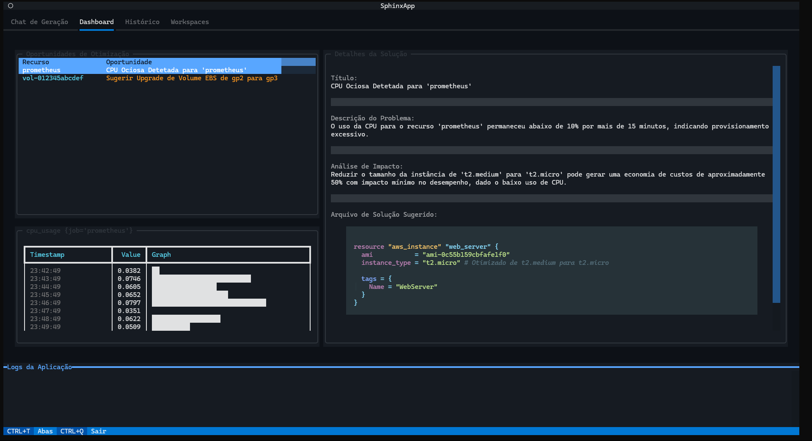
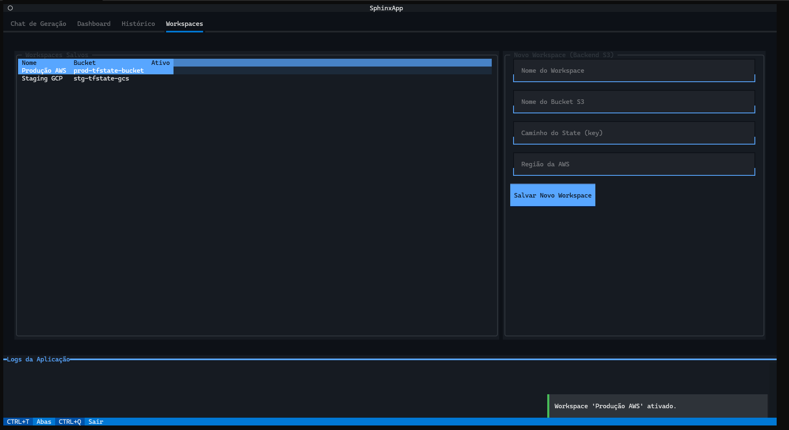

# Sphinx - Plataforma Autônoma de Engenharia de Nuvem

Sphinx é uma plataforma de engenharia de nuvem autônoma interativa e de última geração, meticulosamente desenvolvida em Python para operar inteiramente dentro do ambiente de terminal. Este projeto foi concebido para capacitar engenheiros DevOps, arquitetos de nuvem, SREs e profissionais de infraestrutura com ferramentas avançadas para observabilidade, otimização inteligente e geração de Infraestrutura como Código (IaC). A arquitetura do Sphinx implementa técnicas state-of-the-art em gerenciamento de nuvem orientado por IA, incluindo modelos generativos como Gemini para criação de IaC, sistemas de detecção de anomalias e automação de ciclo fechado. A estrutura segue rigorosamente os princípios de Clean Architecture com o padrão Hexagonal, garantindo modularidade, escalabilidade, manutenibilidade empresarial e uma clara separação de responsabilidades. O sistema se destaca pela sua capacidade de integrar métricas em tempo real do Prometheus, pela sofisticação de sua Interface de Usuário de Terminal construída com o framework Textual, pela robustez de seu sistema de plugins para extensibilidade e pela inclusão de um mecanismo abrangente de histórico de ações com persistência SQLite.

## 🚀 Executável Disponível

📦 **Download Direto**: Executável pré-compilado disponível na seção [Releases](https://github.com/thiagodifaria/Sphinx/releases/download/Sphinx/sphinx.exe) - Sem necessidade de instalação do Python!

## 🎯 Funcionalidades

- ✅ **Geração de IaC orientada por IA**: Linguagem natural para código Terraform via Gemini
- ✅ **Observabilidade em tempo real**: Integração de métricas do Prometheus com dashboard ao vivo
- ✅ **Otimização inteligente**: Detecção automática de oportunidades de custo e performance
- ✅ **Detecção de anomalias**: Motor de análise baseado em regras e plugins
- ✅ **Fluxo completo de IaC**: Gerar, planejar e aplicar mudanças Terraform pela TUI
- ✅ **Histórico de ações**: Trilha de auditoria baseada em SQLite de todas as modificações de infraestrutura
- ✅ **Gerenciamento multi-workspace**: Organizar configurações de infraestrutura por ambiente
- ✅ **Arquitetura de plugins**: Análise extensível com plugins Python customizados
- ✅ **Visualização avançada de métricas**: Gráficos e displays de métricas em tempo real
- ✅ **Automação de ciclo fechado**: Da detecção de anomalias às mudanças de código sugeridas
- ✅ **Regras baseadas em YAML**: Configuração declarativa para condições de detecção
- ✅ **Orquestração Terraform**: Execução perfeita de plan/apply com UI assíncrona
- ✅ **Otimização de recursos AWS**: Plugins integrados para migração EBS GP2→GP3
- ✅ **Interface rica no terminal**: TUI multi-abas com chat, dashboard, histórico e workspaces

## 🔧 Tecnologias

### Core Technologies
- **Python 3.11+**: Linguagem de programação principal com padrões modernos async/await
- **Textual 0.56+**: Framework TUI assíncrono avançado para interfaces ricas de terminal
- **Typer**: Construção elegante de CLI com integração Rich
- **Pydantic 2.7+**: Validação de dados, serialização e gerenciamento de configurações
- **Dependency Injector**: Container de Inversão de Controle para Clean Architecture

### IA & Otimização
- **Google Generative AI**: Modelos Gemini para geração de IaC e sugestões de otimização
- **Detecção Customizada de Anomalias**: Identificação de anomalias baseada em regras e estatística
- **Sistema de Plugins**: Carregamento dinâmico de regras de análise customizadas
- **Motor de Regras YAML**: Lógica de detecção declarativa baseada em thresholds

### Observabilidade & Infraestrutura
- **Prometheus API Client**: Consulta e agregação de métricas em tempo real
- **Terraform**: Execução de Infraestrutura como Código e gerenciamento de estado
- **Docker Compose**: Prometheus containerizado para desenvolvimento local
- **AsyncIO**: Operações não-bloqueantes em toda a stack da aplicação

### Dados & Persistência
- **aiosqlite**: SQLite assíncrono para gerenciamento de histórico e workspaces
- **PyYAML**: Parsing de YAML para regras e arquivos de configuração
- **python-dotenv**: Gerenciamento de variáveis de ambiente com suporte a .env

## 📈 Arquitetura

### Camadas da Clean Architecture

#### Camada Core (`app/core/`)
Lógica de negócio pura sem dependências externas:
- **Modelos de Domínio**: `OptimizationOpportunity`, `IaCFile`, `Metric`, `Workspace`
- **Casos de Uso**: `RunAnalysisCycleUseCase`, `GenerateIacUseCase`, `ApplyInfrastructureChangesUseCase`
- **Portas**: Interfaces abstratas para gateways e providers
- **Serviços**: `AnomalyDetectionService` para análise estatística
- **Interfaces de Plugin**: Classe base `AnalysisRulePlugin` para extensibilidade

#### Camada Adapters (`app/adapters/`)
Implementação das portas do core para sistemas externos:
- **Gateways**: `GeminiAdapter`, `PrometheusGateway`, `SQLiteHistoryRepository`, `YamlRuleRepository`
- **Providers**: `TerraformProvider`, `AwsCloudProvider` para operações de IaC e nuvem

#### Camada Infrastructure (`app/infrastructure/`)
Detalhes de implementação específicos de framework e voláteis:
- **TUI**: Interface baseada em Textual com `SphinxApp`, screens e widgets
- **CLI**: Ponto de entrada de linha de comando com Typer
- **Container DI**: Configuração de injeção de dependência com `dependency-injector`
- **Configuração**: Pydantic Settings com suporte a variáveis de ambiente

### Fluxo de Dados

```
Entrada do Usuário (TUI/CLI)
    ↓
Controllers (Manipuladores de Eventos TUI)
    ↓
Casos de Uso (Lógica de Negócio)
    ↓
Portas (Interfaces Abstratas)
    ↓
Adapters (Implementações Gateway/Provider)
    ↓
Sistemas Externos (Prometheus, Gemini, Terraform, SQLite)
```

## 🎯 Recursos Avançados

### IA Generativa para IaC
- **Entrada em Linguagem Natural**: Descrever necessidades de infraestrutura em português/inglês simples
- **Integração Gemini**: LLM gera código HCL Terraform válido com sintaxe de recursos adequada
- **Saída Estruturada**: Respostas analisadas em JSON garantem geração consistente de código
- **Prompting Especializado**: Prompts de sistema instruem o modelo como especialista sênior em Terraform
- **Integração TUI**: Código gerado exibido na interface de chat com plan/apply imediatos

### Dashboard de Otimização
- **Ciclo de Análise Contínua**: Tarefa em background constantemente avalia saúde da infraestrutura
- **Detecção Multi-Fonte**: Regras YAML + plugins customizados identificam oportunidades
- **Recomendações Baseadas em Evidências**: Cada oportunidade apoiada por métricas do Prometheus
- **Soluções Aprimoradas por IA**: Gemini gera avaliações de impacto e código IaC corrigido
- **Revisão Interativa**: Navegar oportunidades, visualizar métricas e aplicar mudanças pelo dashboard

### Sistema de Plugins
- **Descoberta Dinâmica**: `PluginManager` carrega automaticamente arquivos Python do diretório `plugins/`
- **Baseado em Interface**: Todos os plugins implementam método `AnalysisRulePlugin.analyze()`
- **Acesso a Métricas**: Plugins recebem métricas filtradas para análise específica de domínio
- **Geração de Oportunidades**: Retornar objetos `OptimizationOpportunity` com evidências
- **Exemplos Incluídos**: Templates `EbsGp2ToGp3RulePlugin` e `example_memory_rule.py`

### Motor de Regras YAML
- **Configuração Declarativa**: Definir lógica de detecção sem código em `rules.yml`
- **Operadores Flexíveis**: Comparações de threshold `less_than`, `greater_than`, `equals`
- **Janelas de Duração**: `duration_minutes` para detecção de condições sustentadas
- **Renderização de Templates**: Título/descrição dinâmicos com interpolação de variáveis
- **Integração Prometheus**: Especificação direta de nome de métrica PromQL

### Gerenciamento de Workspaces
- **Suporte Multi-Ambiente**: Configurações separadas para dev, staging, produção
- **Estado de Workspace Ativo**: Singleton global rastreia contexto de trabalho atual
- **Armazenamento Persistente**: SQLite mantém metadados e configurações de workspaces
- **Navegação TUI**: Tela dedicada para criar, alternar e gerenciar workspaces

### Histórico de Ações
- **Trilha de Auditoria Completa**: Cada mudança de infraestrutura registrada com timestamp
- **Persistência SQLite**: Operações assíncronas de banco de dados para gravações não-bloqueantes
- **Metadados Ricos**: Captura workspace, tipo de ação, status e detalhes completos
- **Visualizador de Histórico**: Tela TUI exibe lista cronológica de todas as ações
- **Registros Pesquisáveis**: Filtrar e revisar modificações passadas para conformidade

## 📋 Pré-requisitos

- Python 3.11 ou superior
- Poetry (gerenciador de pacotes)
- Docker & Docker Compose (opcional, para Prometheus local)
- Terraform CLI (para operações de IaC)

## 🚀 Instalação

```bash
# Clonar o repositório
git clone https://github.com/thiagodifaria/Sphinx.git
cd Sphinx

# Instalar dependências com Poetry
poetry install

# Ativar ambiente virtual
poetry shell
```

## ⚙️ Configuração

1. Crie um arquivo `.env` na raiz do projeto:
   ```bash
   touch .env
   ```

2. Adicione as variáveis de ambiente necessárias ao arquivo `.env`:
   ```env
   # Obrigatório: Chave de API Google Gemini
   GOOGLE_API_KEY=sua_chave_google_api_aqui
   
   # Obrigatório: Endpoint do Prometheus
   PROMETHEUS_URL=http://localhost:9090
   
   # Opcional: Caminho do banco de dados (padrão: sphinx.db)
   SQLITE_DB_PATH=sphinx.db
   
   # Opcional: Configuração de backend S3 do Terraform
   TF_BACKEND_S3_BUCKET=seu-bucket-terraform-state
   TF_BACKEND_S3_KEY=terraform.tfstate
   TF_BACKEND_S3_REGION=us-east-1
   
   # Opcional: Caminhos de regras e plugins
   RULES_FILE_PATH=rules.yml
   PLUGINS_DIR=plugins
   ```

3. Configure o Prometheus (opcional para desenvolvimento local):
   ```bash
   # Iniciar Prometheus com Docker Compose
   docker-compose up -d prometheus
   
   # Prometheus estará disponível em http://localhost:9090
   ```

4. Personalize regras de análise em `rules.yml`:
   ```yaml
   rules:
     - name: "Uso Alto de Memória"
       metric_name: "container_memory_usage_bytes"
       condition:
         operator: "greater_than"
         threshold: 85
         duration_minutes: 5
       opportunity_title_template: "Memória Alta em '{resource_id}'"
       opportunity_description_template: "Uso de memória excedeu {threshold}%"
   ```

## 🖥️ Executando a Aplicação

```bash
# Iniciar TUI do Sphinx
poetry run sphinx

# Ou se poetry shell estiver ativado
sphinx

# Executar com arquivo de config customizado
RULES_FILE_PATH=custom-rules.yml sphinx
```

## 📊 Como Usar

### Abas da Interface Principal

#### 1. Chat de Geração
- Inserir descrições em linguagem natural de necessidades de infraestrutura
- Exemplo: "Criar um bucket S3 na AWS com versionamento habilitado"
- Visualizar código Terraform gerado em tempo real
- Copiar código ou prosseguir diretamente para plan/apply

#### 2. Dashboard
- Navegar lista de oportunidades de otimização detectadas
- Visualizar métricas detalhadas e evidências para cada oportunidade
- Ver avaliações de impacto e código de solução gerados por IA
- Aplicar mudanças sugeridas com um clique
- Monitorar saída de execução do Terraform

#### 3. Histórico
- Revisar lista cronológica de todas as ações de infraestrutura
- Filtrar por workspace, tipo de ação ou status
- Visualizar detalhes completos de mudanças passadas
- Exportar histórico para relatórios de conformidade

#### 4. Workspaces
- Criar novos workspaces para diferentes ambientes
- Alternar contexto de workspace ativo
- Gerenciar configurações específicas de workspace
- Excluir workspaces não utilizados

### Visualizador de Logs (Rodapé)
- Logs em tempo real de todas as operações em background
- Níveis de severidade com código de cores (INFO, WARNING, ERROR)
- Rolagem automática com alternância de bloqueio de rolagem
- Persistente em todas as abas

## 🔌 Criando Plugins Customizados

1. Crie um novo arquivo Python no diretório `plugins/`:
   ```python
   # plugins/minha_regra_customizada.py
   from app.core.plugins.interfaces import AnalysisRulePlugin
   from app.core.domain.models.observability import Metric
   from app.core.domain.models.optimization import OptimizationOpportunity
   
   class MinhaRegraCustomizadaPlugin(AnalysisRulePlugin):
       def analyze(self, metrics: list[Metric]) -> list[OptimizationOpportunity]:
           opportunities = []
           
           # Sua lógica de análise customizada aqui
           for metric in metrics:
               if self._deve_otimizar(metric):
                   opp = OptimizationOpportunity(
                       title=f"Otimização customizada para {metric.labels.get('instance')}",
                       description="Sua descrição",
                       resource_address="aws_instance.example",
                       evidence=[metric]
                   )
                   opportunities.append(opp)
           
           return opportunities
       
       def _deve_otimizar(self, metric: Metric) -> bool:
           # Sua lógica de detecção
           return metric.value > 80
   ```

2. Reinicie o Sphinx - o plugin será automaticamente descoberto e carregado

## 📷 Screenshots

### Dashboard - Oportunidades de Otimização


### Chat - Geração de IaC Orientada por IA


### Visualização do Workspace


### Histórico de Ações


## 🚢 Deploy

### Executável Standalone
```bash
# Instalar PyInstaller
poetry add --group dev pyinstaller

# Criar executável
poetry run pyinstaller --onefile --name sphinx app/__main__.py
```

### Container Docker
```bash
# Construir imagem
docker build -t sphinx:latest .

# Executar container
docker run -it --rm \
  -e GOOGLE_API_KEY=sua_chave \
  -e PROMETHEUS_URL=http://host.docker.internal:9090 \
  sphinx:latest
```

## 📜 Licença

Este projeto está licenciado sob a licença MIT - veja o arquivo [LICENSE](LICENSE) para detalhes.

## 📞 Contato

Thiago Di Faria - [thiagodifaria@gmail.com](mailto:thiagodifaria@gmail.com)

Link do projeto: [https://github.com/thiagodifaria/Sphinx](https://github.com/thiagodifaria/Sphinx)